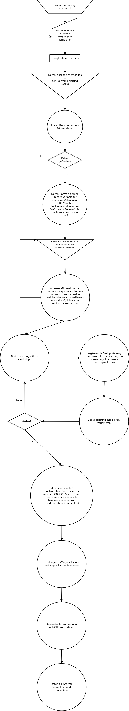
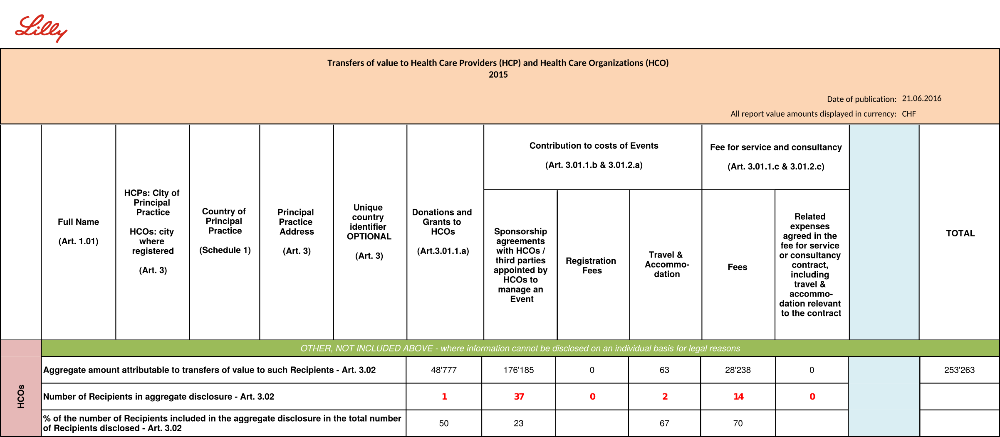

# 2016-10-Pharma-Zahlungen

## Publikation

Die Daten in diesem Repository beziehen sich auf die Publikationsreihe zu den Zahlungen von Pharmafirmen an Dritte (z.&nbsp;B. [dieser Artikel](http://www.srf.ch/news/schweiz/so-viel-pumpt-die-pharma-in-die-gesundheitsbranche)), publiziert im Zeitraum vom 4. August bis zum 17. Oktober 2016.

## Beschreibung

### Glossar der Zahlungsempfänger-Typen

| Abkürzung | Bedeutung | Veröffentlichungsgrundlage |
| :-------- | :-------- | :------------------------- |
| **HCO** | **H**ealth **C**are **O**rganizations (Spitäler, Gemeinschaftspraxen, Gesundheitszentren, Patienten- und Fachverbände etc.) | [_Pharma-Kooperations-Kodex_](https://www.scienceindustries.ch/engagements/pharmakodex/unterzeichner-des-pharma-kooperations-kodexes) |
| **HCP** | **H**ealth **C**are **P**rofessionals (Ärzte, Therapeuten etc.) | [_Pharma-Kooperations-Kodex_](https://www.scienceindustries.ch/engagements/pharmakodex/unterzeichner-des-pharma-kooperations-kodexes) |
| **PO** | **P**atienten**o**rganisationen | [_Pharmakodex_](https://www.scienceindustries.ch/engagements/pharma-kodex-und-pharma-kooperations-kodex/unterzeichner-des-pharmakodexes) |

_Bei den Patientenorganisationen handelt es sich faktisch um eine Teilmenge der HCO. Der Unterschied besteht alleinig in der Veröffentlichungsgrundlage._

### Datengrundlage

Die Daten basieren auf den gesamten Offenlegungen derjenigen Pharmafirmen, welche entweder den [_Pharmakodex_](https://www.scienceindustries.ch/engagements/pharma-kodex-und-pharma-kooperations-kodex/unterzeichner-des-pharmakodexes) oder den [_Pharma-Kooperations-Kodex_](https://www.scienceindustries.ch/engagements/pharmakodex/unterzeichner-des-pharma-kooperations-kodexes) (ähnlich dem [_EFPIA-Kodex_](http://transparency.efpia.eu/the-efpia-code-2)) unterzeichneten. Eine Übersicht über diese Firmen inkl. den Datenfundstellen und detailliertem Offenlegungs-Status findet sich in [**diesem Google Sheet**](https://docs.google.com/spreadsheets/d/15fnfNlBpNlsK2x1881r33cRCuU1gS0r29HgApltoLWA#gid=1658350066).

### Datenvorverarbeitung

Die von den einzelnen Pharmafirmen offengelegten Daten wurden von [SRF Data](http://www.srf.ch/news/srf-data) gesammelt, maschinenlesbar gemacht, in einen gemeinsamen Datensatz zusammengeführt und bereinigt. Folgende Abschnitte umschreiben die vollzogenen Arbeitsschritte.

#### Datensammlung

Die Webseiten der unterzeichnenden Pharmafirmen wurden am Stichtag 1. Juli 2016 nach den Listen der Zahlungsempfänger durchsucht. Wo eine solche Liste auffindbar war, wurde sie heruntergeladen und händisch in eine Datenbank kopiert. Zum Teil veröffentlichen die Firmen nur ein nicht-maschinenlesbares PDF, dieses musste zuerst mit [OCR](https://de.wikipedia.org/wiki/Texterkennung) durchsuchbar gemacht werden. In wenigen Fällen wurden die Daten nach dem Stichtag aktualisiert, vor allem wenn es Indizien gab, dass die Liste der Pharmafirma initial Fehler aufweiste. Eine Übersicht über den Offenlegungs-Status findet sich in [diesem Google Sheet](https://docs.google.com/spreadsheets/d/15fnfNlBpNlsK2x1881r33cRCuU1gS0r29HgApltoLWA#gid=1658350066).

#### Deduplikation

Die [Deduplikation](https://de.wikipedia.org/wiki/Duplikaterkennung) der Zahlungsempfänger war dabei einer der aufwändigsten Arbeitsschritte, da die Ausgangsdaten eine grosse Variation in Schreibweise und Genauigkeit der Zahlungsempfänger- und Adressbezeichnungen aufweisen. Die Deduplikation fand in einem mehrstufigen Prozess statt, welcher nicht vollautomatisiert durchgeführt werden konnte. Zurückgegriffen wurde auf die [Google Maps Geocoding API (GMGAPI)](https://developers.google.com/maps/documentation/geocoding/intro), das Kommandozeilenprogramm [csvdedupe](https://github.com/datamade/csvdedupe) sowie einiges an Handarbeit. Insbesondere aufgrund der mangelnden Reproduzierbarkeit letzterens wird auf die Veröffentlichung des entsprechenden R-Scriptes verzichtet und nur das fertige Resultat der Deduplikation publiziert. Genauer gesagt werden in diesem Repository nur Daten mit den deduplizierten HCO/PO zugänglich gemacht, auf die Veröffentlichung der deduplizierten HCP wird bewusst verzichtet. Die Begründung dafür findet sich am Ende [dieses Artikels](http://www.srf.ch/news/schweiz/gekaufte-aerzte-wie-die-finanzspritzen-der-pharmas-wirken).

Die Deduplikation der HCO/PO fand 2-stufig statt, d.&nbsp;h. die HCO/PO wurden auf der ersten Stufe zu Clustern und auf der zweiten Stufe zu Superclustern zusammengefasst.

- Ein `cluster` wird durch eine einzigartige `cluster_ID` identifiziert und umfasst im Allgemeinen eine einzige HCO/PO. Alle Zahlungen, welche an dieselbe HCO/PO gingen, weisen dieselbe `cluster_ID` auf.

- Ein `supercluster` wird durch eine einzigartige `supercluster_ID` identifiziert und ist im Wesentlichen ein Cluster, der einen oder mehrere andere Cluster zusammenfasst. Ein Supercluster dient dazu, bestimmte gleichartige HCO/PO zu gruppieren (bspw. alle Mitgliedsorganisationen der Rheumaliga Schweiz wie etwa die Rheumaliga Zürich, Rheumaliga Aargau, Rheumaliga Solothurn etc.). Alle Zahlungen, welche an denselben Supercluster gingen, weisen dieselbe `supercluster_ID` auf.

**Hinweis**: Obwohl die Deduplikation einer mehrstufigen Qualitätskontrolle unterzogen wurde, kann es sein, dass zwei unterschiedliche Organisationen in das gleiche `cluster` kategorisiert wurden, oder dass zwei gleiche Organisationen, die unterschiedlich bezeichnet wurden, in unterschiedliche `cluster` oder sogar `supercluster` kategorisiert wurden. Wir schätzen dieses Risiko aber als gering ein. 

#### Übersicht über die einzelnen Schritte der Datenvorverarbeitung

Die einzelnen Schritte der gesamten Vorverarbeitung werden durch folgendes Flussdiagramm grob veranschaulicht:  

### Datenbeschreibung des Inputs

"Input" meint die Ausgangsdatensätze im Ordner [`input`](input), die aus der Datenvorverarbeitung resultieren und auf denen die eigentliche statistische Analyse basiert.

- [**`data_main.Rds`**](input/data_main.Rds) oder [**`data_main.csv`**](input/data_main.csv)

    Der Hauptdatensatz als [`.Rds`](https://stackoverflow.com/questions/21370132/r-data-formats-rdata-rda-rds-etc)- oder [`.csv`](https://de.wikipedia.org/wiki/CSV_(Dateiformat))-Datei. Er kann als möglichst umfassende Datenbank der Zahlungen mit Stichtag 1. Juli 2016 betrachtet werden und enthält alle einzelnen Zahlungen der Pharmafirmen. Da Zahlungen an anonyme Empfänger von den Pharmafirmen in aggregierter Form offengelegt werden, die Angabe der Gesamtzahl Zahlungsempfänger aber optional ist und daher von vielen Pharmafirmen nicht genannt wird, ist es nicht möglich, die genaue Anzahl anonymisierter Zahlungsempfänger zu eruieren. Die Aggregatsdaten wurden so erfasst, dass die maximal mögliche Anzahl anonymisierter Zahlungsempfänger resultiert. Die tatsächliche Zahl dürfte tiefer liegen. Selbstverständlich ändert sich dadurch nichts an den Gesamtbeträgen – diese wurden exakt erfasst.

    Kurzes Beispiel zum besseren Verständnis der Erfassung anonymisierter Zahlungen:

    

    Obiger Tabellenausschnitt zeigt die aggregierten/anonymisierten HCO-Offenlegungen der Pharmafirma _Eli Lilly_. Die Anzahl anonymisierter Zahlungsempfänger je Zahlungskategorie ist rot eingefärbt. Wie anhand des leeren `TOTAL`-Feldes rechts davon ersichtlich wird, wurde darauf verzichtet, die Gesamtzahl anonymisierer HCO-Zahlungsempfänger zu nennen. Im einen Extremfall verteilen sich die Zahlungen auf nur 37 Zahlungsempfänger (d.&nbsp;h. alle anonymisierten Zahlungsempfänger aus anderen Zahlungskategorien als `Sponsorship agreements` sind eine Teilmenge dieser 37 Zahlungsempfänger). Im anderen Extremfall sind es 54 Zahlungsempfänger (1 + 37 + 2 + 14; d.&nbsp;h. es gibt keine Überschneidungen zwischen den Zahlungsempfängern der verschiedenen Kategorien). Im hier publizierten Datensatz wurden die Zahlungen gemäss dem zweiten Extremfall erfasst.

    Daneben gilt es noch zu erwähnen, dass ein beträchtlicher Teil der Zahlungen in den sechs einzelnen Zahlungskategorien keine Werte (`NA`) aufweist, sondern nur einen Gesamtbetrag unter `amount` bzw. `amount_CHF`. Dies rührt entweder daher, dass die Zahlung aus einer PO-Offenlegung gemäss _Pharmakodex_ stammt – dort werden die Beträge nie nach einzelnen Zahlungskategorien aufgeschlüsselt. Oder daher, dass die entsprechende Pharmafirma eine Aufschlüsselung nach Zahlungskategorie auf unklare Weise vornahm bzw. versäumte. Da die Zahlungskategorien ohnehin nicht allzu aussagekräftig scheinen und von den verschiedenen Pharmafirmen offenbar unterschiedlich gehandhabt werden, sind in erster Linie die Werte unter `amount` bzw. `amount_CHF` relevant.

| Variable | Typ | Beschreibung |
| :------- | :-- | :----------- |
| `UID` | integer | Eindeutige numerische Kennung der Zahlung |
| `company_ID` | double | Numerische Kennung der betreffenden Pharmafirma |
| `company` | character | Name der betreffenden Pharmafirma |
| `company_locality` | character | Sitz der betreffenden Pharmafirma |
| `payment_receiver` | character | Name des Zahlungsempfängers |
| `payment_receiver_cluster_ID` | integer | Numerische Kennung des Zahlungsempfänger-Clusters |
| `payment_receiver_cluster` | character | Name des Zahlungsempfänger-Clusters |
| `payment_receiver_supercluster_ID` | integer | Numerische Kennung des Zahlungsempfänger-Superclusters |
| `payment_receiver_supercluster` | character | Name des Zahlungsempfänger-Superclusters |
| `amount` | double | Zahlungsbetrag (in der Originalwährung) |
| `currency` | character | Währung |
| `amount_CHF` | double | Zahlungsbetrag in Schweizer Franken |
| `payment_purpose` | character | Zahlungszweck (oft ungenau oder nicht vorhanden) |
| `year` | integer | Das betreffende Jahr der Zahlung |
| `payment_receiver_type` | character | Typ des Zahlungsempfängers: `HCO`, `HCP` oder `PO` |
| `is_anonymous` | logical | `TRUE` bzw. `WAHR` bedeutet, dass der Zahlungsempfänger anonym ist. |
| `is_hospital` | logical | `TRUE` bzw. `WAHR` bedeutet, dass der Zahlungsempfänger ein Spital/eine Klinik ist. |
| `is_foreign` | logical | `TRUE` bzw. `WAHR` bedeutet, dass die Zahlungsempfängerin eine internationale Firma/Organisation ist. |
| `payment_receiver_description` | character | Beschreibung des Zahlungsempfängers (meist nicht vorhanden oder nur eine Webadresse) |
| `payment_receiver_locality` | character | Ortschaft/Gemeinde des Zahlungsempfängers (nicht normalisiert) |
| `payment_receiver_address` | character | Adresse/Anschrift des Zahlungsempfängers (nicht normalisiert) |
| `g_country_code` | character | Mittels [Google Maps Geocoding API (GMGAPI)](https://developers.google.com/maps/documentation/geocoding/intro) normalisierte Länderbezeichnung des Zahlungsempfängers in 2 Buchstaben gemäss [ISO 3166-1 ALPHA-2](https://de.wikipedia.org/wiki/ISO-3166-1-Kodierliste); bislang kommen nur `CH` (Schweiz) `LI` (Liechtenstein) in den Daten vor. |
| `g_canton` | character | Mittels GMGAPI normalisierte Kantonsbezeichnung in 2 Buchstaben |
| `g_district` | character | Mittels GMGAPI normalisierter [Bezirk](https://de.wikipedia.org/wiki/Bezirk_(Schweiz)) des Zahlungsempfängers |
| `g_locality` | character | Mittels GMGAPI normalisierte Ortschaft/Gemeinde des Zahlungsempfängers |
| `g_postal_code` | integer | Mittels GMGAPI normalisierte Postleitzahl des Zahlungsempfängers |
| `g_sublocality` | character | Mittels GMGAPI normalisierte Verwaltungseinheit innerhalb der übergeordneten Gemeinde (`g_locality`); im Falle von Zürich bspw. die Kreise 1 bis 12 |
| `g_street` | character | Mittels GMGAPI normalisierte Strasse des Zahlungsempfängers |
| `g_street_nr` | character | Mittels GMGAPI normalisierte Hausnummer des Zahlungsempfängers |
| `g_latitude` | double | Mittels GMGAPI ermittelter geographischer Breitengrad des Zahlungsempfängers; fällt je nach Qualität der Ursprungsdaten (`payment_receiver_locality` und `payment_receiver_address`) unterschiedlich präzise aus. |
| `g_longitude` | double | Mittels GMGAPI ermittelter geographischer Längengrad des Zahlungsempfängers; fällt je nach Qualität der Ursprungsdaten (`payment_receiver_locality` und `payment_receiver_address`) unterschiedlich präzise aus.  |
| `g_location_type` | character | GMGAPI-Bezeichner für die Genauigkeit der ermittelten Adresse; für die Bedeutung der möglichen Werte siehe die [Entwicklerdokumentation](https://developers.google.com/maps/documentation/geocoding/intro#Results) |
| `g_place_ID` | character | [Eindeutige Ortskennung](https://developers.google.com/places/place-id) der GMGAPI |
| `donations_and_grants` | double | Der Zahlungskategorie _Spenden und Zuwendungen_ zugeordneter Teilbetrag von `amount`; die Währung aller vorhandenen Werte ist `CHF`, eine Umrechnung erübrigt sich daher. |
| `sponsorships` | double | Der Zahlungskategorie _Sponsoring_ zugeordneter Teilbetrag von `amount`; die Währung aller vorhandenen Werte ist `CHF`, eine Umrechnung erübrigt sich daher. |
| `registration_fees` | double | Der Zahlungskategorie _Beiträge an Anmeldegebühren_ zugeordneter Teilbetrag von `amount`; die Währung aller vorhandenen Werte ist `CHF`, eine Umrechnung erübrigt sich daher. |
| `travel_and_accomodation` | double | Der Zahlungskategorie _Reise- und Unterkunftskosten_ zugeordneter Teilbetrag von `amount`; die Währung aller vorhandenen Werte ist `CHF`, eine Umrechnung erübrigt sich daher. |
| `fees` | double | Der Zahlungskategorie _Honorare für erbrachte Dienstleistungen_ zugeordneter Teilbetrag von `amount`; die Währung aller vorhandenen Werte ist `CHF`, eine Umrechnung erübrigt sich daher. |
| `related_expenses` | double | Der Zahlungskategorie _Zusätzliche Auslagen für erbrachte Dienstleistungen_ zugeordneter Teilbetrag von `amount`; die Währung aller vorhandenen Werte ist `CHF`, eine Umrechnung erübrigt sich daher. |
| `source_date` | Date | Datum der Datenerfassung (Abruf der Daten von der betreffenden Pharmawebsite) |
| `currency_conversion_date` | Date | Datum der Währungsumwandlung; kann bei Zahlungen, deren Ursprungswährung (`currency`) `CHF` ist, ignoriert werden. |
| `currency_conversion_rate` | double | Umrechnungungskurs, der für die Berechnung von `amount_CHF` zum Zeitpunkt `currency_conversion_date` benutzt wurde; beträgt bei Zahlungen, deren Ursprungswährung (`currency`) `CHF` ist `1`. |

- [**`data_rd.Rds`**](input/data_rd.Rds) oder [**`data_rd.csv`**](input/data_rd.csv)

    R&D-Datensatz als [`.Rds`](https://stackoverflow.com/questions/21370132/r-data-formats-rdata-rda-rds-etc)- oder [`.csv`](https://de.wikipedia.org/wiki/CSV_(Dateiformat))-Datei. Er enthält die Gesamtsumme pro Pharmafirma, welche für geldwerte Leistungen im Zusammenhang mit Forschung und Entwicklung an HCO oder HCP gezahlt wurde. Diese Zahlen werden von den Pharmafirmen nur in aggregierter bzw. anonymisierter Form veröffentlicht, sodass keine Aussage darüber getroffen werden kann, welche die einzelne Zahlungsempfänger sind oder wieviel diese erhielten.

| Variable | Typ | Beschreibung |
| :------- | :-- | :----------- |
| `company_ID` | double | Numerische Kennung der betreffenden Pharmafirma |
| `company` | character | Name der betreffenden Pharmafirma |
| `year` | character | Das betreffende Jahr der Ausgaben. |
| `research_and_development` | double | Der Gesamtbetrag, welcher für geldwerte Leistungen im Zusammenhang mit Forschung und Entwicklung an HCO oder HCP gezahlt wurde. |

### Datenbeschreibung des Outputs (nach Analyse)

"Output" meint die aggregierten Statistiken im Ordner [`output`](output), die aus der Ausführung von `analysis.Rmd` resultieren. Eine Ausnahme davon bildet die Datei [`cluster_payment_summary_hco_2015_by_amount_augmented.csv`](output/cluster_payment_summary_hco_2015_by_amount_augmented.csv), welche sich nicht mit dem Script reproduzieren lässt, da sie händisch erweitert wurde (siehe unten).

- [**`general_analysis_summary.md`**](output/general_analysis_summary.md)

    Diese [Markdown](https://de.wikipedia.org/wiki/Markdown)-Datei bietet eine allgemeine Übersicht, welche nicht voraussetzt, dass die Zahlungsempfänger zuvor dedupliziert wurden. Es handelt sich damit weitgehend um eine Analyse der Zahlungsgeber (Pharmafirmen) und liefert Informationen wie die Gesamtzahl an Pharmafirmen, Zahlungssummen nach Zahlungskategorie etc.

- [**`company_summary_2015.csv`**](output/company_summary_2015.csv)

    In dieser Tabelle finden sich Gesamtsummen und Prozentsätze der Zahlungen pro Pharmafirma, aufgeschlüsselt nach untenstehenden Kategorien. Geldwerte Leistungen im Zusammenhang mit Forschung und Entwicklung wurden dabei dem anonymen Totalbetrag (`total_anon_amount_CHF`) zugerechnet, weil sie von den Pharmafirmen nur in aggregierter/anonymisierter Form veröffentlicht werden.

| Variable | Typ | Beschreibung |
| :------- | :-- | :----------- |
| `company_ID` | integer | Numerische Kennung der betreffenden Pharmafirma |
| `company` | character | Name der betreffenden Pharmafirma |
| `total_amount_CHF` | double | Gesamtsumme, die die Pharmafirma 2015 an HCO, HCP und PO bezahlte |
| `research_and_development` | double | Betrag in CHF, den die Pharmafirma 2015 für geldwerte Leistungen im Zusammenhang mit Forschung und Entwicklung an HCO und HCP zahlte |
| `total_known_amount_CHF` | double | Gesamtbetrag, den die Pharmafirma 2015 an namentlich bekannte Zahlungsempfänger bezahlte |
| `total_anon_amount_CHF` | double | Gesamtbetrag, den die Pharmafirma 2015 an anonymisierte Zahlungsempfänger bezahlte (inkl. `research_and_development`) |
| `total_known_percentage` | double | Prozentsatz von `total_amount_CHF`, den die Pharmafirma 2015 an namentlich bekannte Zahlungsempfänger bezahlte |
| `total_anon_percentage` | double | Prozentsatz von `total_amount_CHF`, den die Pharmafirma 2015 an anonymisierte Zahlungsempfänger bezahlte |
| `HCP_amount_CHF` | double | Gesamtbetrag (ohne `research_and_development`), den die Pharmafirma 2015 an HCP bezahlte |
| `HCO_amount_CHF` | double | Gesamtbetrag (ohne `research_and_development`), den die Pharmafirma 2015 an HCO/PO bezahlte |
| `HCP_percentage` | double | Prozentsatz von `total_amount_CHF - research_and_development`, den die Pharmafirma 2015 an HCP bezahlte |
| `HCO_percentage` | double | Prozentsatz von `total_amount_CHF - research_and_development`, den die Pharmafirma 2015 an HCO/PO bezahlte |
| `HCP_known_amount_CHF` | double | Teilbetrag von `HCP_amount_CHF`, den die Pharmafirma 2015 an namentlich bekannte HCP bezahlte |
| `HCP_anon_amount_CHF` | double | Teilbetrag von `HCP_amount_CHF`, den die Pharmafirma 2015 an anonymisierte HCP bezahlte |
| `HCP_known_percentage` | double | Prozentsatz von `HCP_amount_CHF`, den die Pharmafirma 2015 an namentlich bekannte HCP bezahlte |
| `HCP_anon_percentage` | double | Prozentsatz von `HCP_amount_CHF`, den die Pharmafirma 2015 an anonymisierte HCP bezahlte |
| `HCO_known_amount_CHF` | double | Teilbetrag von `HCO_amount_CHF`, den die Pharmafirma 2015 an namentlich bekannte HCO bezahlte |
| `HCO_anon_amount_CHF` | double | Teilbetrag von `HCO_amount_CHF`, den die Pharmafirma 2015 an anonymisierte HCO bezahlte |
| `HCO_known_percentage` | double | Prozentsatz von `HCO_amount_CHF`, den die Pharmafirma 2015 an namentlich bekannte HCO bezahlte |
| `HCO_anon_percentage` | double | Prozentsatz von `HCO_amount_CHF`, den die Pharmafirma 2015 an anonymisierte HCO bezahlte |

- [**`category_contributions_summary_2015.csv`**](output/category_contributions_summary_2015.csv)

    Diese Tabelle enthält die Zahlungssumme pro Pharmafirma und Zahlungskategorie.

| Variable | Typ | Beschreibung |
| :------- | :-- | :----------- |
| `company_ID` | integer | Numerische Kennung der betreffenden Pharmafirma |
| `company` | character | Name der betreffenden Pharmafirma |
| `research_and_development` | double | Betrag in CHF, den die Pharmafirma 2015 für geldwerte Leistungen im Zusammenhang mit Forschung und Entwicklung an HCO und HCP zahlte |
| `donations_and_grants` | double | Betrag in CHF, den die Pharmafirma 2015 in der Zahlungskategorie _Spenden und Zuwendungen_ an HCO und HCP zahlte |
| `sponsorships` | double | Betrag in CHF, den die Pharmafirma 2015 in der Zahlungskategorie _Spenden und Zuwendungen_ an HCO und HCP zahlte |
| `registration_fees` | double | Betrag in CHF, den die Pharmafirma 2015 in der Zahlungskategorie _Spenden und Zuwendungen_ an HCO und HCP zahlte |
| `travel_and_accomodation` | double | Betrag in CHF, den die Pharmafirma 2015 in der Zahlungskategorie _Spenden und Zuwendungen_ an HCO und HCP zahlte |
| `fees` | double | Betrag in CHF, den die Pharmafirma 2015 in der Zahlungskategorie _Spenden und Zuwendungen_ an HCO und HCP zahlte |
| `related_expenses` | double | Betrag in CHF, den die Pharmafirma 2015 in der Zahlungskategorie _Spenden und Zuwendungen_ an HCO und HCP zahlte |
| `indeterminate` | double | Teilbetrag von `total` in CHF, den die Pharmafirma 2015 an PO zahlte oder an HCO und HCP zahlte, aber keiner der vorhergehenden 6 Kategorien zuwies |
| `total` | double | Gesamtsumme, die die Pharmafirma 2015 an HCO, HCP und PO bezahlte |

- [**`hco_analysis_summary.md`**](output/hco_analysis_summary.md)

    Diese [Markdown](https://de.wikipedia.org/wiki/Markdown)-Datei bietet eine Übersicht über die zu Clustern zusammengefassten HCO/PO. Voraussetzung ist, dass diese Zahlungsempfänger zuvor dedupliziert wurden. Enthalten sind Informationen wie die Gesamtzahl deduplizierter HCO/PO (Clusters/Superclusters), die Gesamtsumme und Anzahl Zahlungen pro (Super-)Cluster, der maximale, minimale, mittlere Totalbetrag pro (Super-)Cluster etc.

- [**`cluster_payment_summary_hco_2015_by_amount.csv`**](output/cluster_payment_summary_hco_2015_by_amount.csv) und [**`supercluster_payment_summary_hco_2015_by_amount.csv`**](output/supercluster_payment_summary_hco_2015_by_amount.csv)

    Diese beiden Tabellen enthalten die Zahlungssumme pro HCO/PO-Cluster bzw. -Supercluster, geordnet nach Höhe. `supercluster_payment_summary_hco_2015_by_amount.csv` diente als Grundlage für den Artikel [Name_Artikel vom 17. Oktober](hyperlink). Eine nach `is_hospital == FALSE` und `is_foreign == FALSE` gefilterte [Version](output/cluster_payment_summary_hco_2015_by_amount_augmented.csv), die zusätzlich die manuell recherchierte Information beinhaltet, ob es sich beim Empfänger um eine Patientenorganisation oder eine Fachgesellschaft handelt (1 = ja, 0 = nein), wurde als Grundlage für den begleitenden 10vor10-Beitrag verwendet. Datengrundlage für die im Artikel eingebettete, durchsuchbare Tabelle sind hingegen die [aufbereiteten Rohdaten](input/data_main.csv) (siehe Kapitel "Datenbeschreibung des Inputs").

| Variable | Typ | Beschreibung |
| :------- | :-- | :----------- |
| `payment_receiver_cluster` / `payment_receiver_supercluster` | character | Name des entsprechenden Zahlungsempfänger-Clusters bzw. -Superclusters |
| `is_hospital` | logical | `TRUE` bzw. `WAHR` bedeutet, dass der Zahlungsempfänger ein Spital/eine Klinik ist. |
| `is_foreign` | logical | `TRUE` bzw. `WAHR` bedeutet, dass die Zahlungsempfängerin eine internationale Firma/Organisation ist. |
| `total_amount_CHF` | double | Gesamtbetrag, den der Zahlungsempfänger 2015 von allen erfassten Pharmafirmen zusammen erhielt |
| `nr_of_payments` | integer | Gesamtzahl der Zahlungen, die der Zahlungsempfänger 2015 von allen erfassten Pharmafirmen erhielt |
| `nr_of_pharma_companies` | integer | Anzahl Pharmafirmen, welche zu `total_amount_CHF` beitrugen |

### Das Analyse-Script ausführen

Um die Analyse selbst durchlaufen zu lassen, muss das R-Markdown-Script `analysis.Rmd` sowie der Ordner `input` mit den enthaltenen `.Rds`-Dateien heruntergeladen und in einer geeigneten [R](https://www.r-project.org/)-Umgebung wie [RStudio](https://www.rstudio.com/products/rstudio/download/) ausgeführt werden. Die Ergebnisse werden in den Ordner `output` geschrieben.

## Haftungsausschluss

Die veröffentlichten Informationen sind mit grösster Sorgfalt zusammengestellt, erheben aber keinen Anspruch auf Aktualität, Vollständigkeit oder Richtigkeit. Es wird keine Haftung übernommen für Schäden, die  durch die Verwendung dieses Scripts oder der daraus gezogenen Informationen entstehen. Dies gilt ebenfalls für Inhalte Dritter, die über dieses Angebot zugänglich sind.

## Lizenz

 2016-10-Pharma-Zahlungen von <a xmlns:cc="http://creativecommons.org/ns#" href="https://github.com/srfdata/2016-10-pharma-zahlungen" property="cc:attributionName" rel="cc:attributionURL">SRF Data</a> ist lizenziert unter einer <a rel="license" href="http://creativecommons.org/licenses/by-sa/4.0/">Creative Commons Namensnennung – Weitergabe unter gleichen Bedingungen 4.0 International Lizenz</a>.

## Kontakt

Bei Fragen wenden Sie sich bitte an data@srf.ch oder an [@srfdata](https://twitter.com/srfdata)
